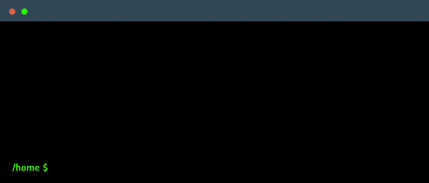

# Milionarios

Repositório com o código para conferência de jogos da MegaSena.

Esse repositório contém o código para o Command Line Interface (CLI) escrito em python que permite a conferência
de multipolos jogos da MegaSena.

Para instalar, basta clonar o repositório, criar um virtualenv e executar o pip install, como sugerido abaixo:

```bash
$ git clone https://github.com/Riverfount/milionarios.git
$ cd milionarios
$ python -m venv .venv
$ source .venv/bin/activate
$ pip install -e .
```
Feita a instalação basta executar como mostrado na imagem abaixo:
